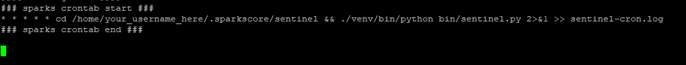
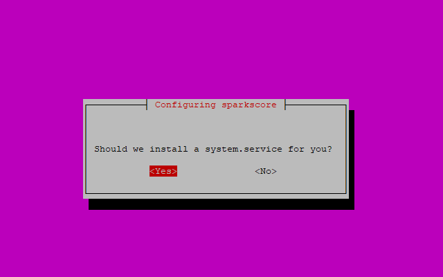
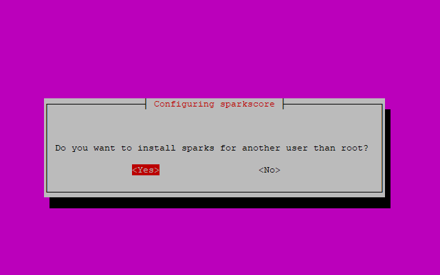
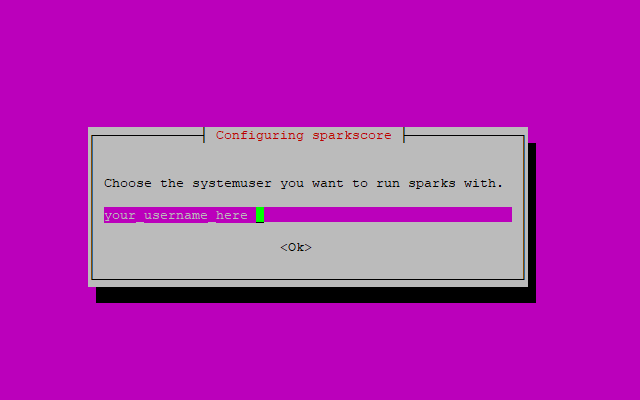
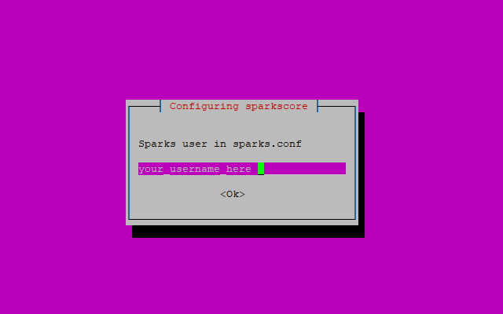
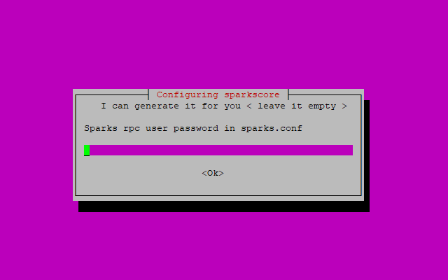
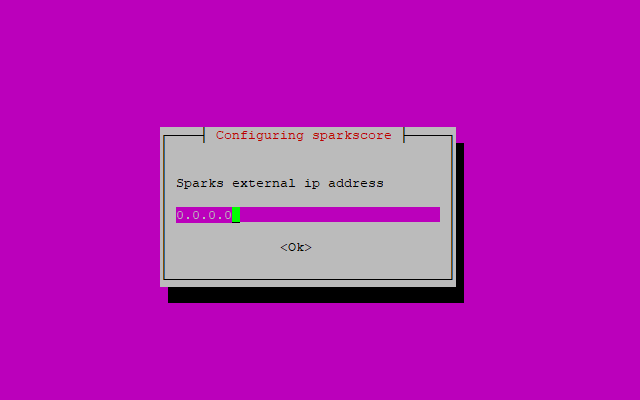
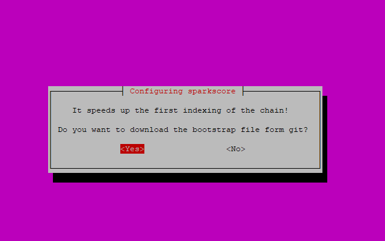
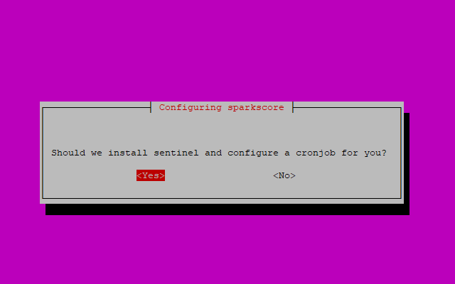

## SparksCore 0.12.3.2

install

# Installation process

## Dialog walkthrough

  

Accept if you want to install a system.service on your server the file    
will be located on **/etc/systemd/system/$coin_name.service**  
***

  

If you say **YES** you'll get the next dialog to choose the user you  
want to configure sentinel / masternode and systemservice to run.  
  
On **No** sparkscore will install as root ( not recommended )  
***

  
Here you type in your username, delete suggested root and type in your
username
***

  
Same as the "system user" you can specify a username for your sparks.conf  
***

  
You are free to leave it empty because the script will generate a **random**  
and quite safe password in sparks.conf  
***

  
The Coin RPC Port could collidate with other coins on multi MN settings. You  
can easly choose a free and unused port for you!  
***  

  
If you have a multiple IP settings on your server you can configure your  
external IP. Leave it empty if you want to get your external IP automated.  
***  

  
You can speed up your first indexing of blocks if you say **Yes** the  
boostrap.file will be downloaded and install in your coincore directory.  
***  

  
Some coins do need sentinel from their maintainer. If this dialog appears  
you can say **YES** and your sentinel client will be installed automatically.  
***

  
Here you are > if you left the Dialog with your external IP Settings empty  
this Dialog will show you what network script thinks your external IP is.  
***

